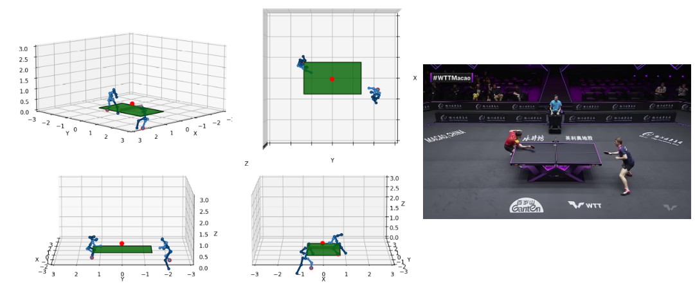

# TT3D: Table tennis match 3D reconstruction

This is the code for TT3D, a table tennis 3D reconstruction method that works with monocular videos. It performs the camera calibration and ball trajectory 3D reconstruction. 

- [Project Page](https://cogsys-tuebingen.github.io/tt3d/)
- [Paper](https://arxiv.org/pdf/2504.10035)



If you encounter any difficulties with the code, feel free to reach out to us.

##  Setup
All the python dependencies are in the requirements.txt.

```
pip install -r requirements.txt
```

Our pipeline also depends on external codebase:
- 2D Pose Estimation: [RTMPose](https://github.com/open-mmlab/mmpose/tree/main/projects/rtmpose)
- 2D-3D Pose lifting: [MotionBert](https://github.com/Walter0807/MotionBERT) 
- Ball detection (Currently unavailable because under review): [BlurBall]()


## Video directory structure

Performing the 3D reconstruction requires files from multiple input. We use the following directory structure for processing:

```
video_dir/
├── camera.yaml        # Camera calibration information
├── rally.mp4          # Video of the rally
├── mb_input.json      # 2D poses generated by `cvt_json.py`
├── player_0.npy       # 3D pose of player 0 generated by MotionBert
├── player_1.npy       # 3D pose of player 1 generated by MotionBert
├── p0_3d.npy          # 3D pose of player 0 in the world frame
├── p1_3d.npy          # 3D pose of player 1 in the world frame
├── ball_traj_3D.csv   # 3D ball trajectory 
├── ball_traj_2D.csv   # 3D ball trajectory from blurball
├── 3d_render.mp4      # Video of the 3D reconstruction
```

We will refer to video_dir as ```<dir>``` for the rest.

## Camera Calibration
To test out the segmentation model:
```
python tt3d/calibration/segment.py ./data/calibration_test/videos/test_00.mp4 --display
```

You can process the whole video with the following command. It will output a csv file with the raw observations (no filtering).

To test out the calibration pipeline:
```
python tt3d/calibration/calibrate.py ./data/calibration_test/videos/test_00.mp4 -o cam_cal.csv
```

Once the measurements have been generated, they need to filtered with a kalman filter that will also perform outlier rejection.
```
python tt3d/calibration/filter.py cam_cal.csv --so -w 1280 -he 720 --display

```

It is also possible to generate the videos of the rendering by adding the argument --render

## Pose estimation
In our paper, we use [RTMPose](https://github.com/open-mmlab/mmpose/tree/main/projects/rtmpose) and [MotionBert](https://github.com/Walter0807/MotionBERT) to reconstruct the 3D pose. Then we align the estimated 3D pose in the world frame by minizing the reprojection error.

:exclamation: MotionBert is not able to capture human motion in the depth direction of the camera. We compensate for this by recalculating the position of the player when his feets are touching the ground. However, other much heavier models such as [4DHumans](https://github.com/shubham-goel/4D-Humans) are able to do so. We recommend using such models if you are not limited by compute power.

### 2D pose estimation
- Install mmpose using these [instructions](https://mmpose.readthedocs.io/en/latest/installation.html).
- Activate conda env 'openmmlab'
- Generate the 2D pose using mmpose with rtmpose (tracking activated)
```
 python process_video.py  --input ./data/calibration_test/videos/test_00.mp4  --output-root  vis_results   --save-predictions
```
- Correct the tracking

### 2D-3D pose lifting
For this, we relly on [MotionBert](https://github.com/Walter0807/MotionBERT).

- Convert the output of RTMPose to a json that can be read by MotionBert
```
python tt3d/pose/cvt_json.py <dir>/result_rally_2d.json
```
- Use this [script](https://github.com/Walter0807/MotionBERT/blob/main/infer_wild.py) to generate 3D pose. You need to change the focus depending on which player you want to infer the 3D pose of.
```
python infer_wild.py \
--vid_path <dir>/rally.mp4 \
--json_path <dir>/mb_input.json \
--out_path <dir>/player_0.npy
--focus 0
```

- Generate aligned pose by minimizing the reprojection error.
```
python tt3d/pose/align.py <dir>
```


## TT3D
- Because some videos are encoded at a different framerate then they were recorded, there can be duplicate frames in the video which make the reconstruction fail. As such we first extract all the unique frames.
```
python generate_unique_frames.py
```
- Run [BlurBall]() and get the 2D ball position
<!-- ``` -->
<!-- python3 src/main.py --config-name=eval_blurball detector.model_path=/home/gossard/Git/blurball_train/outputs/main/blurball/best_model -->
<!-- ``` -->
- Run reconstruction
```
python tt3d/rally/rally.py <dir>
```
- Render the whole trajectory
```
python tt3d/pose/render.py <dir>
```

## Citing
If you find this work useful, please consider citing:
```bibtex
@InProceedings{gossard2025,
          author    = {Gossard, Thomas and Ziegler, Andreas and Zell, Andreas},
          title     = {TT3D: Table Tennis 3D Reconstruction},
          booktitle = {Proceedings of the IEEE/CVF Conference on Computer Vision and Pattern Recognition (CVPR) Workshops},
          month     = {June},
          year      = {2025}
          }
```

